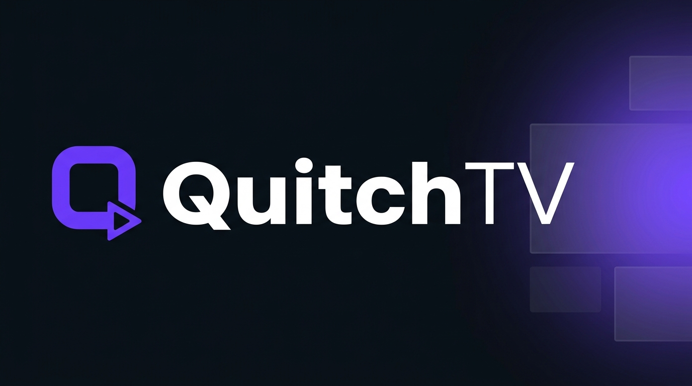
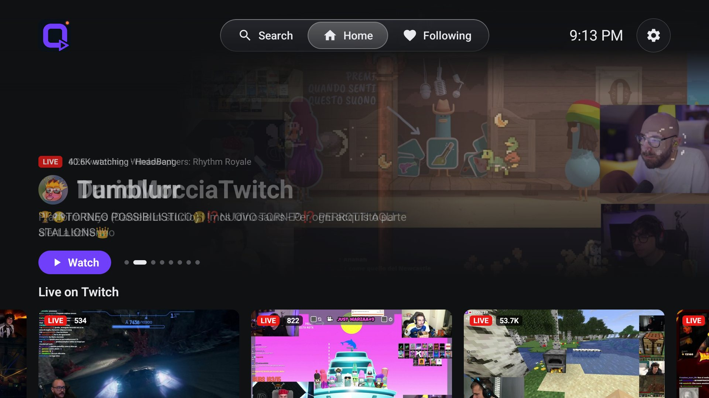
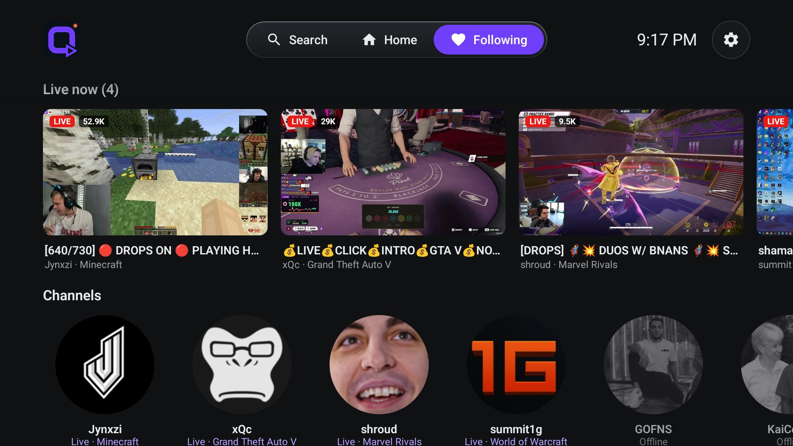
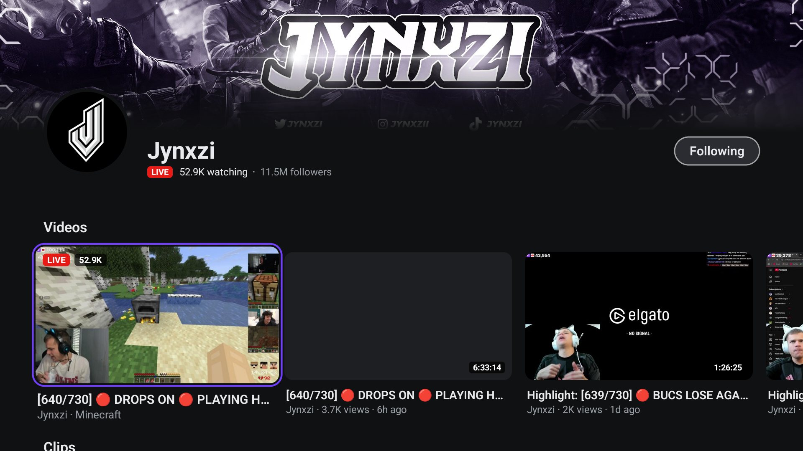
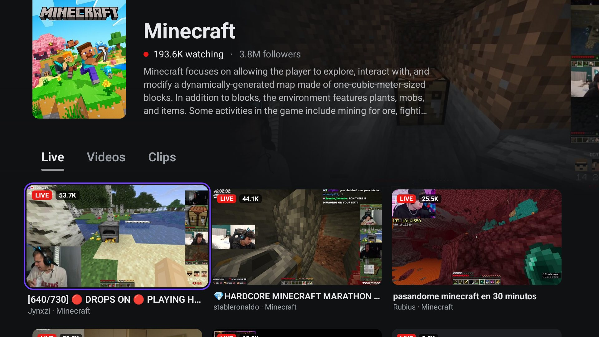
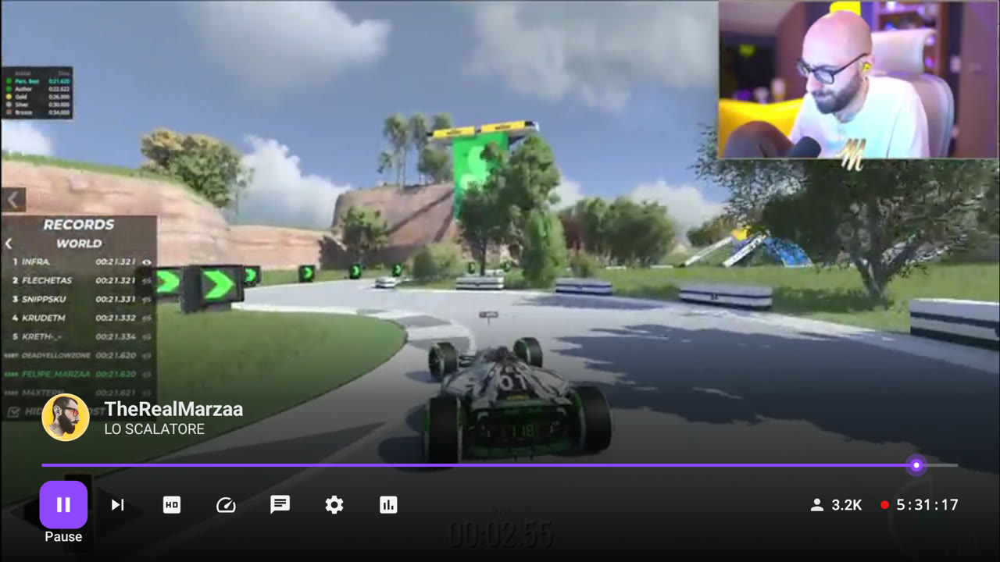
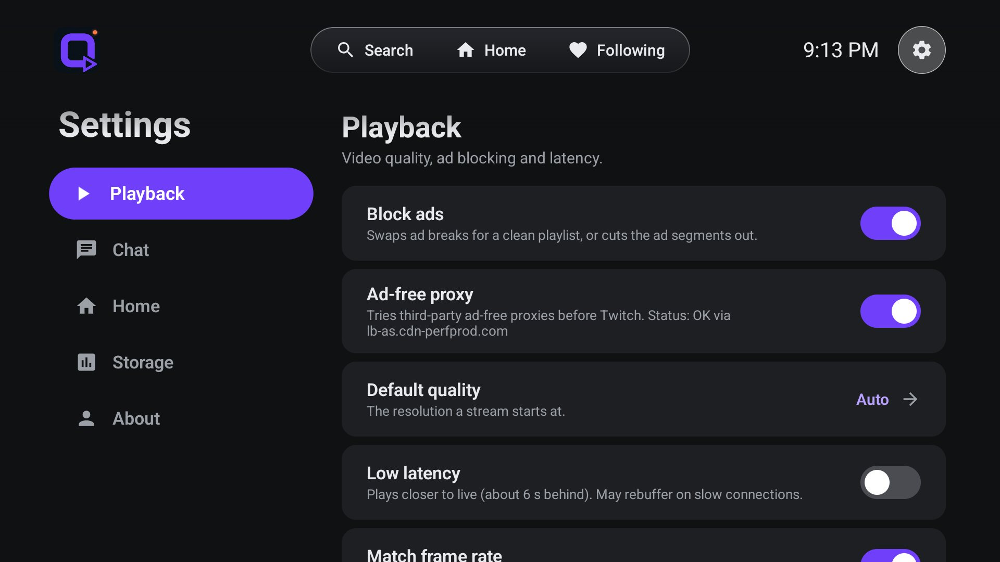

<p align="center">
  
</p>

<p align="center">
  <a href="../../releases/latest"></a>
  
  
</p>

<p align="center">
  A live-streaming app made for the TV remote. It opens straight to live streams, with no login and no account.<br>
  Smooth to navigate, fast to start, and it blocks the ad breaks.
</p>

---

<p align="center">
  
  
</p>
<p align="center">
  
  
</p>
<p align="center">
  
  
</p>

## ✨ Features

|   |   |
|---|---|
| 🚫 **No login, ever** | Open it and watch. Your follows and settings stay on your TV. |
| 🛡️ **Ad blocking** | Ad breaks are skipped or replaced so streams keep playing. |
| ⚡ **Fast start** | Streams start in about a second and a half. |
| 🎯 **Made for the remote** | Smooth focus, remembers where you were in every row, and no lag on cheap TV hardware. |
| 👤 **Creator pages** | Banner, follow button, their videos (live stream first) and clips, with "See all" for the full list. |
| 🗂️ **Category pages** | Cinematic header with the game, live streams, videos and clips with filters. |
| ❤️ **Following** | Everyone you follow in one row: live in colour, offline greyed out. |
| 🎬 **Player** | Live-edge timeline, back to live, quality picker, stats for nerds, and the creator's page opened over the running stream. |
| 💬 **Chat** | Read-only live chat with BTTV, FrankerFaceZ and 7TV emotes. VOD chat replay too. |
| 🔄 **Updates inside the app** | Settings → About tells you when a new version is out and installs it. |

## 📦 Install

Works on **Google TV, Android TV and Fire TV** (Android 7.1 or newer).

### Easiest: with the Downloader app

1. Install **Downloader** from your TV's app store (it's free).
2. Open it and enter `github.com/Mart-inger/QuitchTV/releases/latest`.
3. Pick the **`QuitchTV-x.y.z.apk`** file, download it and choose *Install*. If asked, allow Downloader to install unknown apps.

### From a computer with ADB

1. Download **`QuitchTV-x.y.z.apk`** from the [latest release](../../releases/latest).
2. Turn on ADB debugging on the TV:
   - **Google TV / Android TV:** *Settings → System → About → tap "Android TV OS build" 7 times*, then *Developer options → Network debugging*.
   - **Fire TV:** *Settings → My Fire TV → Developer options → ADB debugging*.
3. Install it:

```bash
adb connect <tv-ip>:5555
```

```bash
adb install -r QuitchTV-x.y.z.apk
```

> 💡 For full smoothness right after installing, run this once:
> ```bash
> adb shell cmd package compile -m speed-profile -f tv.quitch.app
> ```

### Updating

Open **Settings → About**. When a new version exists you'll see "Update available". Press OK, then confirm Android's install prompt. The first time, Android asks you to allow installs from QuitchTV. A red dot on the Settings gear tells you there is an update.

## 🎮 Remote cheat sheet

| Where | Key | Action |
|---|---|---|
| Anywhere in the top bar | ⬇️ | Jump into the current screen |
| Search tab | OK | Open the keyboard (results update as you type) |
| Player, controls hidden | OK / ⬆️ / ⬇️ | Show the controls |
| Player, controls hidden | ⬅️ ➡️ | Seek ±10 s (videos and clips) |
| Player | ⏯ | Play / pause |
| Player | ⏩ | Back to live (live) · +30 s (video) |
| Player controls | ⬆️ on the creator, then OK | Their page opens over the stream; Back returns to it |

## 🔐 Privacy

QuitchTV has no account and no analytics. Follows and settings are stored on your device only. The app talks directly to Twitch's public web services and to the BetterTTV, FrankerFaceZ and 7TV emote services, and to GitHub to check for updates.

## ⚖️ Disclaimer

QuitchTV is an unofficial app for personal use. It is **not affiliated with, endorsed by or connected to Twitch Interactive, Inc.** "Twitch" is a trademark of Twitch Interactive, Inc. The app uses undocumented public web endpoints that can change or stop working at any time. It is free to use; the source code is not published.
